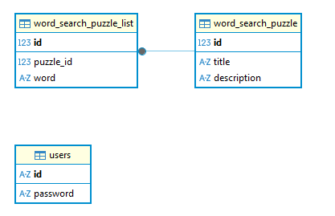

# word search

word search 게임입니다.

## 기획서 요구사항

- Word Search Maker 페이지 (게임 제작 기능)
  - Word Search 게임을 만들 수 있는 어드민 페이지 (Word Search Maker) 제작
  - Word Search Maker에서 Title, Description 및 10개 이상의 단어를 등록하여 게임을 생성할 수 있음
  - Word Search Maker에서 게임 생성시 다른 유저가 참여할 수 있는 링크 생성
- Word Search 게임 기능
  - 링크로 접속시 Start 버튼을 눌러 게임을 시작할 수 있음
  - 게임 페이지에는 n x n 의 영어 글자가 랜덤하게 배치되어 있고 등록한 영어 단어가 중간에 섞여 있으며 유저가 클릭하여 단어를 찾을 수 있음. (자세한 설명은 직접 게임을 해보길 바람.)
- 게임 현황판 기능
  - 게임 페이지 우측에는 현황판이 존재하며 유저들의 현재 점수와 소요 시간을 볼 수 있음 (1~3위는 강조 표시를 할 것)
- 단어 리스트 및 정답 확인 기능
  - 유저가 연결된 단어를 클릭하지 않거나 없는 단어를 클릭할시 틀렸다는 표시를 보여주기.
  - 정답 단어를 클릭하면 맞았다는 표시를 해주고 해당 표시가 유지되게 구현하기.
  - 게임 페이지 좌측에는 찾아야 할 단어 리스트가 보여지고 유저가 단어를 찾으면 표시되어야 함.
- 제목, 설명, 게임 소요 시간을 상단에 표시
  - 게임 페이지 상단에는 게임 시작 후 현재 시간이 얼마나 흘렀는지 볼 수 있으며 제목과 설명이 표시됨.
- 회원 가입 및 로그인 기능을 구현한다. 소셜 로그인을 이용해도 된다.

## 구현 요구사항

- 모든 페이지는 SPA로 동작한다. (React, Svelte 등 웹프레임워크 사용 가능)
- 클라이언트 라우팅을 위한 라이브러리를 사용해도 된다 (React-router-dom, svelte-spa-router 등)
- path에 따라 다른 화면을 보여주도록 라우팅을 구현한다.
- Python의 fastAPI를 사용한다.
- SQLite를 사용한다.
- ERD를 이용해 데이터 모델링을 수행하고, 깃허브 README에 업로드한다
- web socket을 이용하여 현황판의 데이터를 실시간으로 업데이트하도록 구현한다.

## erd



## 실행방법

### 프론트엔드 실행방법

```
cd frontend
npm run dev
```

### 백엔드 실행방법

```
python -m uvicorn main:app --reload
```

## 사이트맵

### "/": Home 페이지

### "/login": Login 페이지

### "/signup": Signup 페이지

### "/admin": Admin 페이지

### "/my": My 페이지

### "/puzzle/:id": Puzzle 페이지
